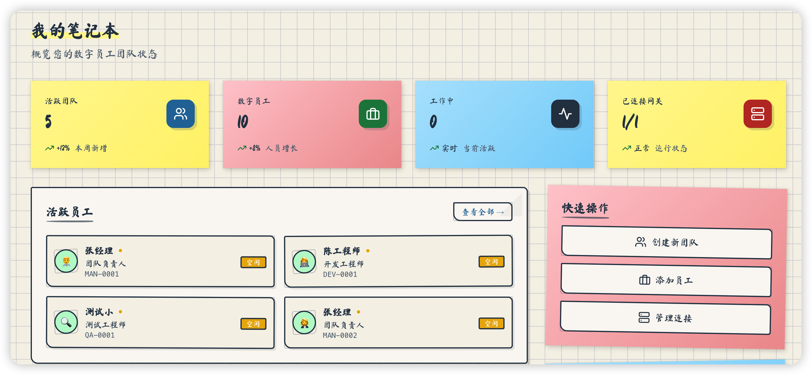
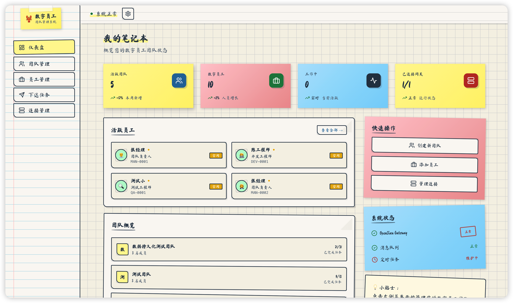
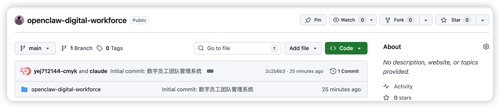
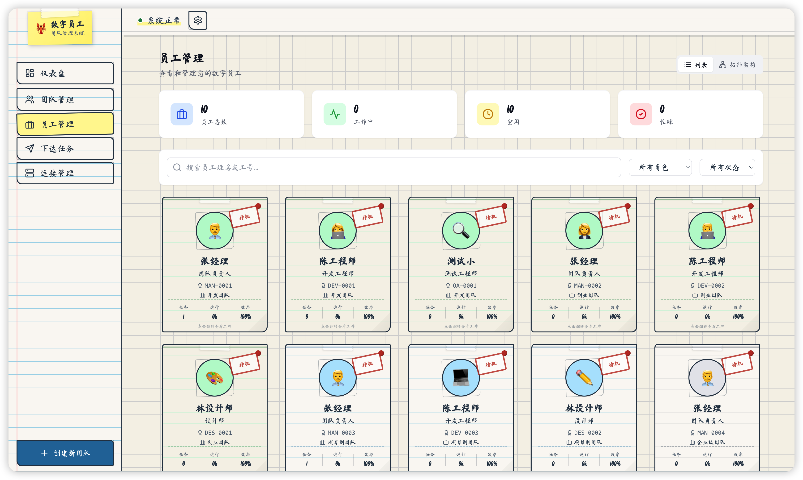
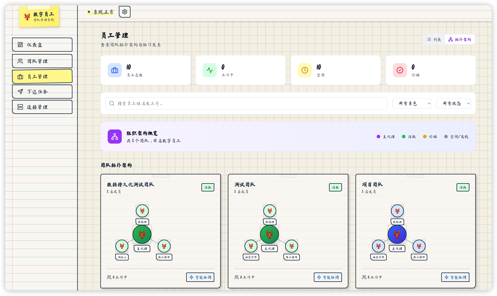
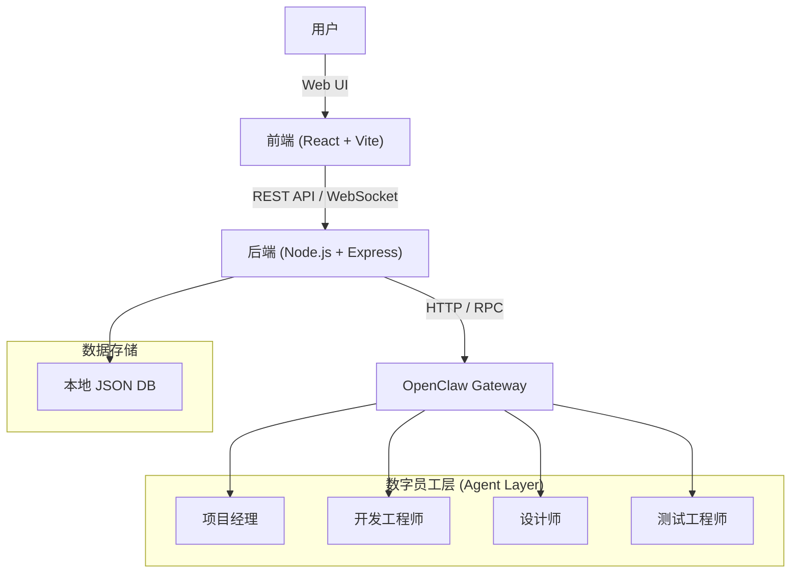
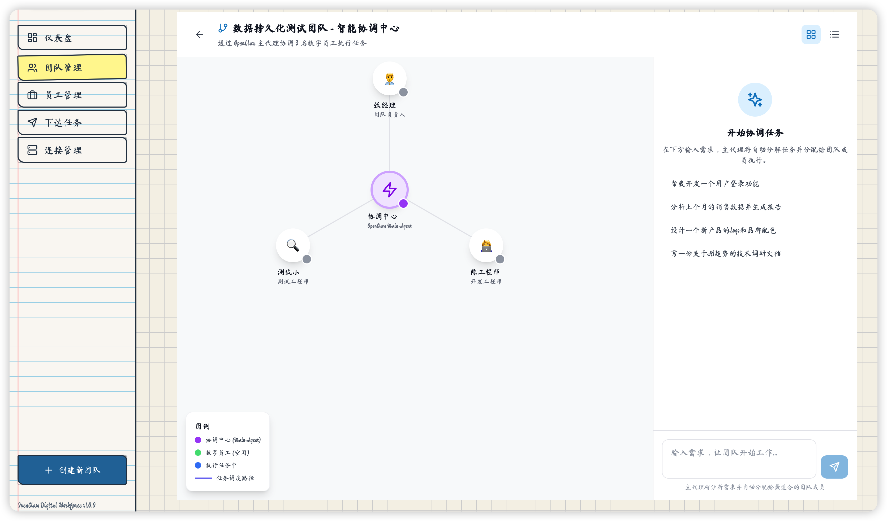

# 🦞 数字员工团队管理系统 (OpenClaw Digital Workforce)

<p align="center">
  
  
  
  
  
</p>

<p align="center">
  <b>让 AI 员工像真人一样协作 —— 基于 OpenClaw 二次开发的企业级多 Agent 协作与编排平台</b>
</p>

<p align="center">
  
</p>

---

## � 目录

- [项目简介](#-项目简介)
- [适用人群](#-适用人群)
- [核心功能](#-核心功能)
- [系统架构](#-系统架构)
- [快速开始](#-快速开始)
- [未来规划](#-未来规划)
- [贡献](#-贡献)

---

## � 项目简介

**数字员工团队管理系统** 是一套可视化的多 Agent (Multi-Agent) 协作平台，旨在解决 OpenClaw 用户在管理多个技能和 Agent 时面临的痛点。就像 Agent Teams 重构 AI 协作逻辑一样，本系统让 AI 团队从“零散组合”变成“有序分工”，大幅降低多 Agent 协作的搭建成本。

核心理念是将 AI Agent 视为具体的职场角色（如"开发工程师"、"产品经理"），通过定义清晰的 **角色 (Role)**、**技能 (Skill)** 和 **工作流 (Workflow)**，实现高效的人机协作和机机协作。

无论是个人开发者还是企业团队，都能通过这套系统，解锁 AI 团队协作的新可能，让 AI 真正成为提升效率的“数字同事”。

---

## 🎯 适用人群

- ✅ **OpenClaw 重度用户**：装了一堆技能，却无法高效管理，想让 AI 协作更有序。
- ✅ **AI Agent 开发者**：需要测试多 SubAgent 协作场景，提升开发与测试效率。
- ✅ **小团队/创业者**：想用 AI 替代部分人力，却不知道如何分工，需要低成本 AI 管理方案。
- ✅ **企业 IT 部门**：想试点 AI 数字员工，需要一套完善、可落地的管理后台，推进数字化转型。

---

## ✨ 核心功能

### 🎫 可视化数字员工工牌系统


- **状态实时监控**：实时展示员工状态（工作中/空闲/忙碌/离线）。
- **效率量化**：通过效率评分、任务完成数、运行时间等多维度数据，直观展示 AI 员工的工作产出。
- **信息全景**：完整的员工信息展示（工号、部门、角色、技能），让“数字员工”形象更立体。

### 👥 一键式团队模板


内置多种标准化团队配置，5分钟即可完成架构搭建：

| 模板 | 描述 | 适用场景 |
|------|------|----------|
| 🚀 **创业团队** | 精简高效，快速迭代 | 初创公司 |
| 🏢 **企业级团队** | 完整配置，大规模协作 | 大型企业 |
| 📁 **项目制团队** | 围绕项目，灵活组建 | 项目交付 |
| 🎧 **客服团队** | 专注支持，高效响应 | 客户服务 |
| 📝 **内容创作团队** | 创意驱动，内容为王 | 媒体运营 |
| 💻 **开发团队** | 纯技术栈，高效开发 | 产品研发 |
| 🔬 **研究团队** | 技术创新，深度研究 | 技术预研 |
| ⚙️ **自定义团队** | 完全自定义配置 | 特殊需求 |

### 🔌 OpenClaw 网关无缝集成


- **100% 兼容**：底层完全兼容 OpenClaw 生态，无需重构环境，直接复用已有技能。
- **多模式连接**：支持本地网关、云端部署或混合模式。
- **自动运维**：自动监控网关状态（健康检查），断线自动重连；自动同步 OpenClaw 技能列表。

### 🎨 角色预设系统


预置 10 种即插即用的 AI 岗位角色，打破角色边界：
- **角色库**：项目经理、开发工程师、设计师、数据分析师、客服专员、研究员、测试工程师等。
- **技能解耦**：支持自由组合搭配，例如让“设计师”同时掌握代码编写技能，打造全能型 AI 员工。

---

## 🏗️ 系统架构

本项目采用 Monorepo 结构，包含前端、后端和 OpenClaw 核心引擎。



### 技术栈

| 层级 | 技术 |
|------|------|
| 前端 | React 18 + TypeScript + Tailwind CSS |
| 后端 | Node.js + Express + TypeScript |
| 网关 | OpenClaw HTTP API |
| 通信 | RESTful API + WebSocket |

### 目录结构

```bash
openclaw-digital-workforce/
├── backend/                # 后端服务 (Node.js)
│   ├── src/
│   │   ├── routes/         # API 路由
│   │   ├── services/       # 业务逻辑 (Agent管理, 任务编排等)
│   │   └── index.ts        # 入口文件
│   └── data/               # 本地数据存储 (JSON)
├── frontend/               # 前端界面 (React)
│   ├── src/
│   │   ├── pages/          # 页面组件 (Dashboard, Teams, Chat等)
│   │   ├── components/     # 通用组件
│   │   └── types/          # TypeScript 类型定义
└── openclaw/               # OpenClaw 核心引擎源码 (Submodule)
```

---

## 🚀 快速开始

### 1. 环境准备
- **Node.js**: v18 或更高版本
- **pnpm**: v8+ (推荐)
- **OpenClaw**: 需要一个运行中的 OpenClaw 实例（可选，系统支持模拟模式）

### 2. 安装依赖

```bash
# 1. 克隆项目
git clone <repository-url>
cd openclaw-digital-workforce

# 2. 一键安装所有依赖
pnpm install
# 或者分步安装
# cd backend && pnpm install
# cd ../frontend && pnpm install
```

### 3. 配置环境

后端默认运行在 `3456` 端口。如果需要修改，请在 `backend` 目录下创建 `.env` 文件：

```bash
# backend/.env
PORT=3456
# 如果有特定的 OpenClaw 网关地址，可以在此预设，或稍后在 UI 中配置
# OPENCLAW_GATEWAY_URL=http://localhost:8000
```

### 4. 启动服务

在项目根目录运行以下命令，将同时启动前端和后端服务：

```bash
pnpm dev
```

- **管理界面**: [http://localhost:5173](http://localhost:5173)
- **后端 API**: [http://localhost:3456](http://localhost:3456)

### 5. 界面预览



---

## 🔮 未来规划

我们将持续迭代，不断完善功能：
- [ ] **工作流编排**：可视化拖拽界面，轻松定义 AI 协作流程，实现复杂任务自动化流转。
- [ ] **绩效考核**：基于任务完成质量的自动评分体系，精准评估 AI 员工工作成效。
- [ ] **知识共享**：实现 AI 员工之间的记忆互通，打破信息壁垒，提升协作效率。
- [ ] **移动端 App**：随时随地管理你的 AI 团队，查看状态、下发指令。

---

## 🤝 贡献

欢迎提交 Issue 和 Pull Request！

1. Fork 本仓库
2. 创建特性分支 (`git checkout -b feature/AmazingFeature`)
3. 提交更改 (`git commit -m 'Add some AmazingFeature'`)
4. 推送到分支 (`git push origin feature/AmazingFeature`)
5. 提交 Pull Request

## 📄 许可证

本项目基于 MIT 协议开源。详见 [LICENSE](LICENSE) 文件。
